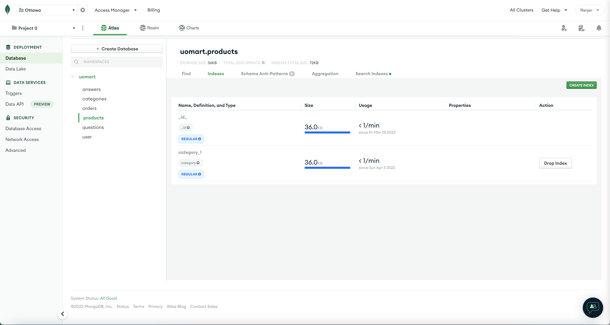

# MongoDB

Database for the Project - UOMart

## Collections

Total Collections: 6\
Collections: answers, categories, orders, products, questions, user

Indexes Created: 

  <strong> 1. Category Id index on products Collection </strong> 
Since we are fetching products for one category, we created an index for fetching the products using category id.

  <strong> 2. User Id index on orders Collection </strong> 
We created this as we are fetching the orders for a specific user. Hence, we created an index for fetching the orders using user id.

  <strong> 3. Question Id index on answers Collection </strong> 
Since we are fetching answers for a particular question, we created an index for fetching the answers using the question id

<em> All the CRUD Operations are working and the API documentation can be accessed from the following link: </em> 
<a href="https://documenter.getpostman.com/view/11041377/UVyuREpy">https://documenter.getpostman.com/view/11041377/UVyuREpy</a>
