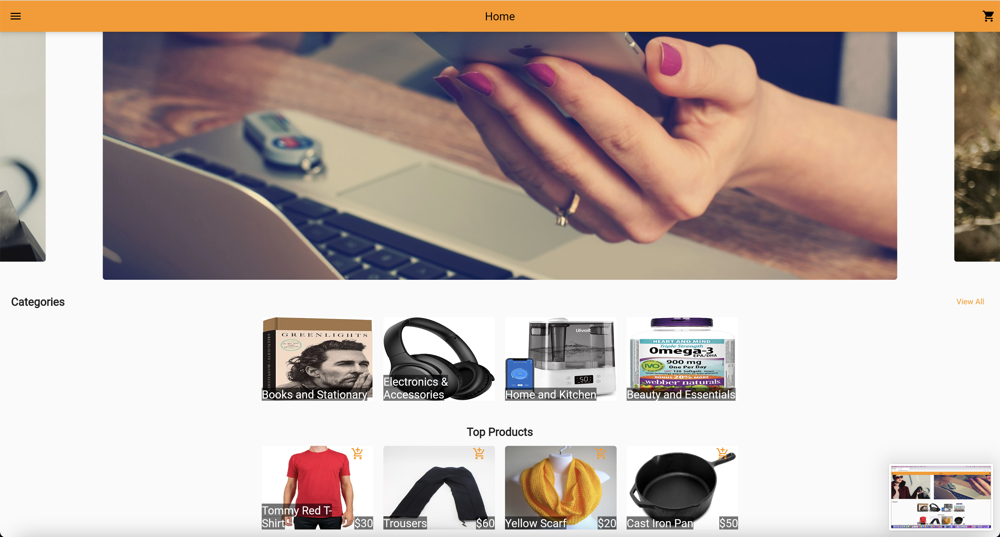

# CSI5112-Project
CSI5112 Software Engineering Project (Group 12)

 

## List of Students
Ranjan Goyal\
Ashish V Muttumana\
Harish Shanmugam\
Hari Kishan\
John Jegede

## [Frontend README](https://github.com/ranjan98/CSI5112ProjectG12/blob/main/frontend/README.md)
  
## [Backend README](https://github.com/ranjan98/CSI5112ProjectG12/blob/main/aspnet/README.md)

## [Postman Testing README](https://github.com/ranjan98/CSI5112ProjectG12/blob/main/aspnet/testing/README.md)

## Deployment
Docker Repository - uomart/csi5112project \
S3 (Frontend) - http://uomart-datafiles.s3-website-us-east-1.amazonaws.com \
CloudFront - https://d1tkoe5inqma72.cloudfront.net \
Backend - https://uomart-499408899.us-east-1.elb.amazonaws.com/api/ \
Link For Frontend - https://web.uomart.net/ \
Link for Backend - https://service.uomart.net/api/  

### API Documentation
https://documenter.getpostman.com/view/11041377/UVyuREpy

## Screenshots
### Desktop View
  
  
### Mobile View
  
